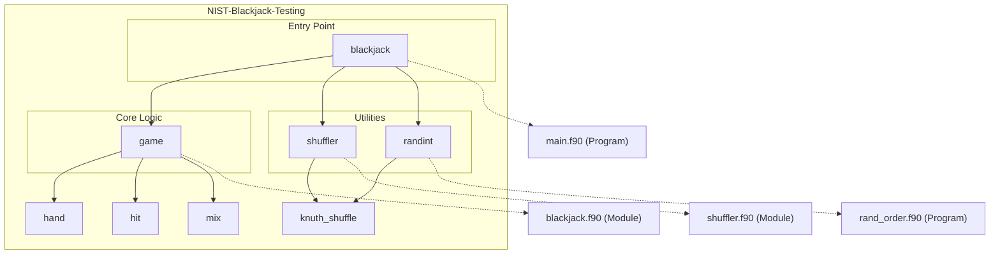

# NIST Blackjack Testing Fed Forum Testing!

## Overview

The **NIST Blackjack Testing** repository provides an implementation of a simplified Blackjack game, complete with shuffling, dealing, and hand evaluation logic. The repository demonstrates modular Fortran programming for scientific and algorithmic purposes, employing foundational algorithms like the Knuth shuffle for randomization. In addition, the repository includes utilities for shuffling integer arrays and command-line programs for randomization tasks, making it versatile for testing and gaming applications. With debugging capabilities and comprehensive modularity, this repository is a robust resource for studying card game mechanics and testing randomization techniques.

## Key Features

- **Blackjack Game Simulation**:
  - Implementation of a simplified Blackjack game where players can evaluate hands, perform hits, and determine outcomes (win, lose, or push).
  
- **Knuth Shuffle Algorithm**:
  - Efficient implementation of the Knuth (Fisher-Yates) shuffle for randomizing card decks and integer arrays.

- **Customizable Randomization**:
  - Utilities for initializing and configuring random number generation for reproducible or dynamic shuffling.

- **Modular Design**:
  - Components such as `shuffler` and `game` modules are designed with separation of concerns, ensuring maintainable, reusable code.

- **Debugging and Testing Tools**:
  - Debug mode for custom card input and testing.
  - Integrated testing scripts in Python and CMake for verifying functionality.

# Layout and Architecture
```
└── b6d73d4b-0869-4b06-a691-3a7f7eca90dd
    └── NIST-Blackjack-Testing
        ├── .github
        │   └── workflows
        │       └── ci.yml         # Continuous Integration configuration.
        ├── CMakeLists.txt         # Build system configuration for CMake.
        ├── CMakePresets.json      # Preset configurations for CMake.
        ├── LICENSE                # Project license.
        ├── app                    # Executable programs.
        │   ├── main.f90           # Blackjack program.
        │   └── rand_order.f90     # Random integer shuffle utility.
        ├── fpm.toml               # Fortran package manager config.
        ├── meson.build            # Build system configuration for Meson.
        ├── src                    # Core source code for Blackjack.
        │   ├── blackjack.c        # Auxiliary C logic for Blackjack.
        │   ├── blackjack.f90      # Game logic for Blackjack.
        │   └── shuffler.f90       # Knuth shuffle implementation.
        └── tests                  # Tests for verifying functionality.
            ├── test_hit.cmake     # CMake test for "hit" functionality.
            ├── test_hit.py        # Python-based tests for the "hit" function.
            └── y.asc              # Test data file (specific use unclear).
```



## Usage Examples

### Build

#### Build the project with CMake
Navigate to the root directory of the repo, create a build directory, and execute the following commands:
```bash
mkdir build
cd build
cmake ..
make
```

### Test

#### Run unit tests using CTest
After building the project, execute the following command to run all tests:
```bash
ctest
```

#### Execute Python-based test for the "hit" function
The Python test script interacts with the executable, ensuring proper behavior for card inputs. Run the script using the target executable as an argument:
```bash
python3 ./tests/test_hit.py ./game
```

#### Test using CMake process for "hit"
CMake-based unit tests for "hit" functionality can be executed as follows (assuming project build):
```bash
execute_process(COMMAND ./game
INPUT_FILE ./tests/y.asc
)
```

### Run

#### Play a Blackjack Game
Run the `Blackjack` program and interactively play while cards are shuffled:
```bash
./game
```
Optionally, enable debugging mode for manual card inputs:
```bash
./game -d
```

### Utility

#### Shuffle integers using `rand_order.f90`
Shuffle an array of integers from `1` to `N` using the Fisher-Yates (Knuth Shuffle) algorithm:
```bash
./rand_order <N>
# Example:
./rand_order 10
```

#### Import Knuth Shuffle in a custom Fortran program
To use the Knuth shuffle algorithm, include the `shuffler` module and invoke `knuth_shuffle` on an array:
```fortran
use shuffler, only : knuth_shuffle

integer :: my_array(10)
my_array = [1,2,3,4,5,6,7,8,9,10]
call knuth_shuffle(my_array)
print *, my_array
```
This script will shuffle the `my_array` elements in place.

---

Each example demonstrates how to build, test, and utilize the features provided in this project, covering comprehensive scenarios from game execution to module reusability.


### Key Feature Implementation Deep Dive

The provided code repository revolves around the implementation of a Blackjack game utilizing modules and subroutines for functionality like shuffling, game logic, and randomized operations. Below are some of the key features identified in the repo based on descriptions and implementation details:

---

#### 1. **Card Shuffling and Randomization (Shuffler Module)**

**Purpose:**  
The `shuffler` module implements the Knuth shuffle algorithm to ensure randomness in the order of elements within arrays, making it ideal for shuffling a deck of cards.

**Implementation:**  
- The `knuth_shuffle` subroutine uses a backward iteration over the array (`A`) while swapping elements to randomize their order. It relies on Fortran's `random_number` function to generate uniform random values.
- Swapping is performed using a temporary variable (`temp`).
- This module exposes `knuth_shuffle` as a public method for use across other modules, ensuring compatibility with the `game` logic when shuffling cards.

**Usage:**  
The `mix` subroutine within the `game` module utilizes `knuth_shuffle` to shuffle the deck (`cards`). Integration with Blackjack ensures fairness during gameplay.

---

#### 2. **Blackjack Game Logic (Game Module)**

**Purpose:**  
The `game` module encapsulates the rules and mechanics of playing a single hand of blackjack, including interactions between the player and dealer.

**Implementation:**
- **Hand Management (`hand`)**
  - This function oversees the player and dealer actions, such as dealing cards, hitting, determining blackjack wins, and busting.
  - Player decisions (`Hit or Stand`) are prompted via terminal inputs using `stdin` and `stdout`.
  - The function evaluates the player's and dealer's scores, outcomes like push or win, and handles special rules like blackjack, busts, and five-card charlie.

- **Card Handling (`hit`)**
  - This subroutine updates scores (`total`), counts Aces (`aces`), and processes the next card in the deck.
  - It adjusts for special rules concerning Aces (switching between 1 and 11 based on the score).

- **Deck Shuffling (`mix`)**
  - The standard deck of 52 cards is initialized with values (Ace = 11, Face cards = 10, others = card values), and shuffled using the `knuth_shuffle` subroutine.

**Usage:**  
The game logic is executed by the `main` program (`blackjack.c`), simulating interactions between the player and dealer and connecting all subroutines.

---

#### 3. **Integration of Fortran and C (Mixed Language Usage)**

**Purpose:**  
The implementation combines Fortran modules (game mechanics, shuffling) and C logic (hand execution, I/O handling).

**Implementation:**  
- C provides the main execution logic for running blackjack hands (`hand` function) and handling game outcomes. It integrates Fortran subroutines via `extern` definitions. Key actions include:
  - Calling `mix` for shuffling the deck (`cards`).
  - Managing the game's state (player and dealer scores, blackjack detection) via `hand` and `hit` functions.
  - Terminal-based queries for player actions using `getchar()`.

- Fortran enriches game modeling with precision (`ISO_C_BINDING`), allowing direct manipulation of integer arrays (`cards`) and handling robustness in shuffling and randomness.

**Usage:**  
This mixed-language approach leverages Fortran's computational strengths (e.g., array management, shuffle logic) and C's performant I/O capabilities, ensuring a seamless user experience.

---

#### 4. **Random Number Initialization (`Randomization Methods`)**

**Purpose:**  
The random number generator ensures repeatability or non-repeating sequences for shuffling and gameplay randomness.

**Implementation:**
- The `random_init` method configures the random number generator based on user preferences (e.g., repeatable or state-saving modes). While not explicitly detailed, this logic enables repeatable testing or unique gameplay sequences.
- The Knuth shuffle utilizes this initialization method indirectly by calling `random_number`.

**Usage:**  
Used primarily by the `shuffler.f90` module as part of its randomization algorithm, ensuring fairness while maintaining predictable testing outcomes when needed.

---

#### 5. **Testing Frameworks**

**Purpose:**  
Testing functionality validates individual components like card dealing (`tests/test_hit.py`) and integration. The modular approach simplifies debugging.

**Implementation:**  
- Python scripts (`test_hit.py`) interface with compiled binaries for validating the `hit` function logic (e.g., score updates).
- CMake tests (`test_hit.cmake`) automate build and validation pipelines.

**Usage:**  
Critical to identifying regressions and ensuring consistency in game mechanics implementations.

---

By thoroughly understanding these key features, developers can improve or extend functionalities like introducing new shuffle algorithms, adding multiplayer interactions, or refining the testing framework. The modular design allows for flexibility across components.


# Implemented User Stories

## Blackjack Gameplay
- [ ] **As a player, I want to shuffle a deck of cards, so that the gameplay begins with randomized card order, which requires the `mix` subroutine.**
- [ ] **As a player, I want to play a hand of Blackjack against the dealer, so that I can evaluate my ability to win against the dealer's cards, which requires the `hand` function.**
- [ ] **As a player, I want to take a "hit" to add a card to my hand, so that my hand can improve or risks busting, which requires the `hit` subroutine.**
- [ ] **As a player, I want to input a debugging flag from the command line, so that I can manually control the card values during testing, which requires command-line argument parsing in `main.f90`.**
- [ ] **As a dealer, I want my hand to automatically take a "hit" when my total is 16 or below, so that the game adheres to standard Blackjack rules, which requires dealer logic within the `hand` function.**

## Deck Operations
- [ ] **As a system, I want to store the full deck of cards, so that 52 cards including numerical and face values are represented for gameplay, which requires array initialization in the `mix` subroutine.**
- [ ] **As a system, I want to shuffle the deck of cards using the Knuth Shuffle algorithm, so that the order is uniformly randomized without bias, which requires the `knuth_shuffle` subroutine in the `shuffler` module.**

## Random Number Generation and Initialization
- [ ] **As a system, I want to initialize the random number generator, so that I can generate repeatable or entirely random shuffle results, which requires `random_init` handling.**
- [ ] **As a system, I want to seed the randomness for avoiding duplicated patterns, so that the gameplay and shuffle results are unpredictable, which requires specific input flags in `random_init`.**

## Command-Line Interaction
- [ ] **As a user, I want to pass a maximum integer to shuffle as input, so that I can produce a shuffled list of integers dynamically, which requires standard input handling in `rand_order.f90`.**
- [ ] **As a programmer, I want to parse command-line arguments within the Blackjack program, so that I can specify whether to use debug mode for manual entry of card values, which requires the `get_command_argument` method in `main.f90`.**

## Debug Mode Handling
- [ ] **As a tester, I want to enable debug mode before starting a hand, so that I can manually select the values of shuffled cards for better control during tests, which requires the debug flag implemented in both `hand` and `mix` operations.**
- [ ] **As a tester, I want to skip randomness during card input in debug mode, so that shuffled cards can be manually set without automated randomness, which requires condition checks in the `hand` function.**

## Integer List Shuffling
- [ ] **As a user, I want to generate a list of integers and shuffle them randomly, so that I can randomize team order or similar scenarios, which requires `rand_order.f90` integration.**
- [ ] **As a user, I want to verify the integrity of shuffled integer lists by reviewing outputs, so that the shuffle results meet expectations, which requires formatted print statements in `rand_order.f90`.**

## Automated Dealer Logic
- [ ] **As a dealer, I want to automatically stop drawing cards when my total exceeds 16, so that the game adheres to Blackjack rules, which requires dealer logic in the `hand` function.**
- [ ] **As a dealer, I want to win automatically when the player busts, so that outcomes for the Blackjack game are properly evaluated based on standard rules, which requires bust detection logic in the `hand` function.**

## Winning Conditions
- [ ] **As a player, I want to win if my hand reaches 21 or gets closer than the dealer's, so that the game outcome is fair, which requires score comparisons in the `hand` function.**
- [ ] **As a dealer, I want to push the game if both player and dealer have the same score, so that ties are handled correctly, which requires equality checks in `hand`.**


# Dependencies


## Intrinsic

Standard Fortran intrinsic modules and functions.
- **iso_c_binding**
  - `c_int`
- **iso_fortran_env**
  - `ALL`
## Internal

Modules and functions defined within this project that are accessed in a different module or program.
- **shuffler**
  - `knuth_shuffle`
- **game**
  - `debug`
  - `hand`
  - `mix`
## External Functions

External (non-Fortran, bound with the C ABI) functions called by this project.
- `hit`
- `knuth_shuffle`
- `mix`
