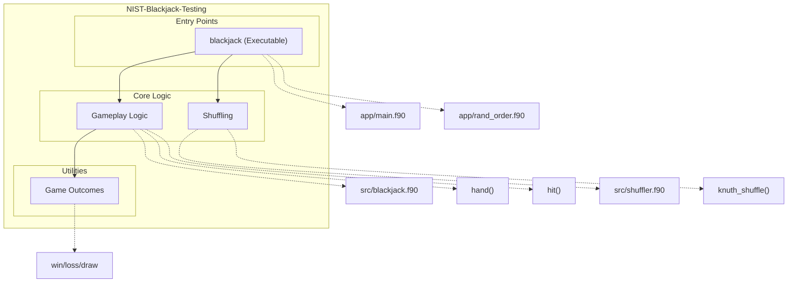

# NIST Blackjack Testing (Test)

## Overview

The NIST Blackjack Testing repository provides a simplified implementation of a Blackjack game alongside tools for testing and verifying shuffling algorithms. The core focus of the project lies in simulating the gameplay of Blackjack, which includes player and dealer interactions, card handling, and game logic. Additionally, the repository features modules for shuffling algorithms, such as the Knuth Shuffle (Fisher-Yates), which ensures uniform randomness in card shuffling. This project is designed using Fortran and includes a range of support for debugging, testing, and random seed initialization.

## Key Features

- **Simplified Blackjack Game**: Core functionality to simulate a Blackjack game, including deck shuffling, player-dealer logic, and win-loss determination.
- **Knuth Shuffle Algorithm**: Implementation of the Fisher-Yates shuffle for uniform randomization of arrays, ensuring unbiased permutations.
- **Random Number Initialization**: Support for initializing random number generators for deterministic or non-deterministic behavior.
- **Debug Mode Supported**: Optional debug mode provides detailed logging for tracing game logic and decision-making.
- **Command-Line Interaction**: Allows users to enable features like debug mode or specify parameters for random integer generation.
- **Testing Framework**: Includes test scripts and files for validating functions like card drawing (`hit`) and shuffling algorithms.

# Layout and Architecture
```
└── a81711b2-c7a0-41d0-87a5-8b5676d25619
    └── NIST-Blackjack-Testing
        ├── .github
        │   └── workflows
        │       └── ci.yml                 # CI/CD workflow configuration.
        ├── CMakeLists.txt                 # CMake build configuration.
        ├── CMakePresets.json              # CMake preset configurations.
        ├── LICENSE                        # Licensing details.
        ├── app                            # Main application programs.
        │   ├── main.f90                   # Blackjack game logic and runner.
        │   └── rand_order.f90             # Random order generator program.
        ├── fpm.toml                       # Fortran package manager configuration.
        ├── meson.build                    # Meson build system configuration.
        ├── src                            # Core implementation source files.
        │   ├── blackjack.c                # C binding for blackjack functionality.
        │   ├── blackjack.f90              # Core blackjack game logic module.
        │   └── shuffler.f90               # Shuffling utility module.
        └── tests                          # Test files and test data.
            ├── test_hit.cmake             # CMake tests for hit subroutine.
            ├── test_hit.py                # Python-based testing script for hit.
            └── y.asc                      # Auxiliary test data file.
```




## Usage Examples

### Build

To build the project, use the following commands. This assumes a standard CMake setup:

```bash
mkdir build
cd build
cmake ..
make
```

### Test

To run the tests, including Python-based and CMake-integrated ones:

- Run the Python tests using:

```bash
python3 tests/test_hit.py
```

- Run CMake-integrated tests using:

```bash
cd build
ctest
```

### Run the Blackjack Game

You can run the main blackjack game as follows:

1. Normal Mode:

```bash
./blackjack
```

2. Debug Mode (optional `-d` flag for debugging):

```bash
./blackjack -d
```

### Run the Random Order Generator

To generate and shuffle a list of integers using the `randint` program:

```bash
./randint 10
```

This will shuffle a list of integers from 1 to 10 and display the results.

### Blackjack Module Functions Usage

Below are some examples of calling the `game` module functions within the Fortran environment:

1. **Shuffling the Deck (`mix` function)**:

Use the `mix` subroutine to shuffle a deck of cards.

```fortran
integer(c_int) :: cards(52)
call mix(cards)
```

2. **Simulate a Blackjack Hand (`hand` function)**:

Simulate a hand of blackjack between a player and a dealer. The deck is passed as an argument.

```fortran
integer(c_int) :: win, cards(52)
call mix(cards)  ! Shuffle the cards
win = hand(cards)  ! Play a hand
```

3. **Drawing a Card (`hit` subroutine)**:

Use the `hit` subroutine to draw a card and update the player's total and ace count.

```fortran
integer(c_int) :: total, aces, i, cards(52)
total = 0
aces = 0
i = 1
call hit(total, aces, i, cards)
```

### Notes

- Make sure to initialize the random number generator with `call random_init(.false., .false.)` before using any random-dependent functions like `knuth_shuffle`.
- Modify player decisions and scenarios within the `hand` function for tailored gameplay.


# Key Feature Implementation Deep Dive

## 1. Blackjack Gameplay Logic (`hand` function)
The `hand` function in the `blackjack.f90` file is the core component of the blackjack simulation. It orchestrates the gameplay between the player and the dealer by:
- Drawing two initial cards for both the player and the dealer using `hit`.
- Allowing the player to make decisions (e.g., `Hit? y / n`) until they either bust or hold.
- Applying automatic win conditions (e.g., blackjack or 5-card Charlie).
- Executing the dealer's actions (e.g., mandatory hits until their total exceeds 16).
- Comparing the final totals of the player and dealer to determine the game outcome (`1` for player win, `2` for a push, and `0` for a dealer win).

Highlights:
- The logic ensures fair gameplay by adhering to blackjack rules.
- Critical use of the `hit` subroutine to handle card draws and score updates.

## 2. Hit Logic for Drawing Cards (`hit` subroutine)
The `hit` subroutine, also found in `blackjack.f90`, manages the process of drawing cards. This includes:
- Drawing the next card in the deck by updating the index `i`.
- Adding card values to the total and handling the count of aces (`aces`).
- Implementing ace adjustment logic to prevent the player from busting due to the flexible value of aces (1 or 11).

Highlights:
- The ace adjustment logic is crucial for accurate scoring.
- Integration with the `debug` mode allows for manual card input for testing purposes.

## 3. Deck Shuffling (`mix` and `knuth_shuffle`)
Deck shuffling is implemented collaboratively by the `mix` subroutine in `blackjack.f90` and the `knuth_shuffle` subroutine in `shuffler.f90`.
- **`mix`:** Initializes an array representing a standard deck of 52 cards (values 2–11) and calls `knuth_shuffle` to randomize it.
- **`knuth_shuffle`:** Implements the Knuth (Fisher-Yates) shuffle algorithm to ensure a uniform shuffle.

The separation of concerns between `mix` and `knuth_shuffle` is notable. `mix` is domain-specific (blackjack-specific deck) and depends on `knuth_shuffle`, which is a general-purpose array shuffling utility.

Highlights:
- The use of a well-known shuffle algorithm ensures fairness and randomness in card distribution.
- Modularity allows `knuth_shuffle` to be reused outside of blackjack.

## Conclusion
These key features—gameplay logic, card drawing, and deck shuffling—form the structural backbone of this blackjack system. They are well-integrated through the use of modular subroutines, ensuring scalable and maintainable code. Developers aiming to enhance this project can focus on expanding features (e.g., additional gameplay rules, multiplayer support), optimizing subroutines, or improving user interaction.


# Implemented User Stories

## **Blackjack Game Simulation**
- [ ] As a blackjack player, I want the game to shuffle a standard 52-card deck before every game round, so that each playthrough has fair randomness, which requires the Knuth Shuffle algorithm.
- [ ] As a blackjack player, I want to receive prompts asking whether I want to "hit" or "stand" during the game, so that I can make dynamic decisions based on my current hand, which requires the `hand` functionality.
- [ ] As a blackjack player, I want to win the game if I score 21 or closer without exceeding it, so that the standard blackjack rules are adhered to, which requires game outcome logic in `hand`.
- [ ] As a blackjack player, I want the game to automatically adjust my score and count aces as 1 if my total exceeds 21, so that I can avoid immediate busts caused by aces, which requires the `hit` subroutine.
- [ ] As a blackjack dealer, I want to automatically continue drawing cards until I reach or exceed 17, so that the dealer always plays fairly, which requires the dealer logic in `hand`.
- [ ] As a blackjack player, I want automated feedback telling me whether I won, lost, or tied with the dealer after every game, so that I can understand the game outcome, which requires return values in `hand`.
- [ ] As a game developer, I want the player's and dealer's moves to be logged when debug mode is enabled, so that I can trace or debug the game's execution, which requires the `debug` flag.

## **Deck Shuffling**
- [ ] As a blackjack player, I want the shuffled deck to preserve all card values (e.g., 2–11), so that the shuffling doesn't change the deck's integrity, which requires the `mix` function to initialize decks correctly.
- [ ] As a software engineer, I want a reusable implementation of the Knuth Shuffle algorithm for any integer array, so that I can support fair randomization in other contexts, which requires `knuth_shuffle`.
- [ ] As a user generating random integers, I want to specify a range of integers to shuffle, so that randomization can support various input sizes, which requires `randint`.

## **Gameplay Logic**
- [ ] As a blackjack player, I want the dealer's initial showing card to be displayed, so that I can make better-informed decisions on whether to "hit" or "stand," which requires printing logic in `hand`.
- [ ] As a blackjack player, I want to win immediately when I score blackjack on my first turn, so that I am rewarded for earning a perfect hand, which requires early win conditions in `hand`.
- [ ] As a developer, I want game rounds to terminate immediately when a player's hand total exceeds 21, so that computation time is saved during unwinnable situations, which requires win/loss checks in `hand`.

## **Debugging and Testing Features**
- [ ] As a developer, I want the deck state and card-by-card gameplay to be displayed in debug mode, so that I can trace how the cards are being dealt and scored, which requires `debug` across gameplay methods.
- [ ] As a CI/CD engineer, I want automated tests for the `hit` subroutine validating the ace adjustment logic, so that regression errors are prevented, which requires Python and CMake tests in `test_hit`.
- [ ] As a CI/CD engineer, I want a test system that validates shuffling is fair (all card values appear in output deck), so that the Knuth Shuffle implementation can be trusted, which requires `mix` and `knuth_shuffle`.

## **Random Order Generator**
- [ ] As a user, I want to generate a shuffled sequence of integers representing teams or groups, so that I can assign members to random teams in a fair way, which requires `randint`.
- [ ] As a user, I want to input the maximum integer value for team order generation, so that group sizes can be adjusted dynamically to requirements, which requires custom command-line inputs in `randint`.
- [ ] As a developer, I want the shuffle order generation to work independently of external dependencies, so that the functionality is portable and flexible, which requires random and allocation logic in `randint`.

## **Command-line and Interaction**
- [ ] As a user, I want to enable debug mode using a command-line argument, so that advanced logs are displayed during gameplay, which requires `get_command_argument`.


# Dependencies


## Intrinsic

Standard Fortran intrinsic modules and functions.
- **iso_fortran_env**
  - `ALL`
- **iso_c_binding**
  - `c_int`
## Internal

Modules and functions defined within this project that are accessed in a different module or program.
- **shuffler**
  - `knuth_shuffle`
- **game**
  - `debug`
  - `hand`
  - `mix`
## External Functions

External (non-Fortran, bound with the C ABI) functions called by this project.
- `hit`
- `knuth_shuffle`
- `mix`
